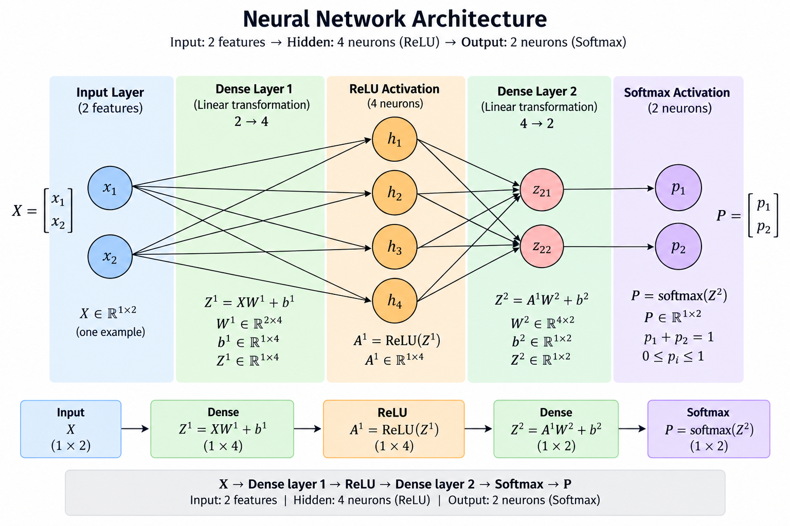

# 02 — ANN From Scratch

## Goal

Build and train a two-layer Artificial Neural Network (ANN) from first principles
with NumPy to solve the non-linear XOR classification problem, which a single neuron
in `01-neuron` could not learn.

The network learns the following forward pass:

```text
Z1 = X @ W1 + b1
A1 = relu(Z1)
Z2 = A1 @ W2 + b2
P  = softmax(Z2)
```

Where:

- `X` is the batch of input features (shape `(m, 2)`).
- `W1` contains weights connecting the 2 inputs to 4 hidden neurons (shape `(2, 4)`).
- `b1` is the hidden-layer bias (shape `(1, 4)`).
- `A1` is the non-linear hidden activation after ReLU (shape `(m, 4)`).
- `W2` contains weights connecting the 4 hidden neurons to 2 output classes (shape `(4, 2)`).
- `b2` is the output-layer bias (shape `(1, 2)`).
- `Z2` contains raw output class scores (logits) (shape `(m, 2)`).
- `P` contains normalized class probabilities summing to 1.0 per example (shape `(m, 2)`).



## Project structure

```text
02-ann-from-scratch/
├── README.md
├── ANN.png
├── src/
│   └── ann.py            # NumPy implementation, training, and automated verification
└── steps/
    └── step-01-mathematics.md
```

## Learning workflow

| Step | Status | Evidence |
| --- | --- | --- |
| 1. Mathematics | Complete | `steps/step-01-mathematics.md` (Q1–Q10) |
| 2. NumPy implementation | Complete | `dense_forward`, `relu`, `softmax`, `cross_entropy` |
| 3. Forward pass | Complete | `forward(X, params)` with activation cache |
| 4. Loss | Complete | Categorical cross-entropy with numerical clipping |
| 5. Derive gradients | Complete | First-principles chain rule derivation in Q7 |
| 6. Backpropagation | Complete | `backward(Y, cache, params)` computing all parameter gradients |
| 7. Train model | Complete | `train(X, Y, params, lr, epochs)` on XOR |
| 8. Debug & analyze | Complete | Exact asserts on hand-calculated math & 100% XOR accuracy |
| 9. PyTorch implementation | Pending | Next step: `src/ann_torch.py` |
| 10. Compare results | Pending | Compare NumPy vs PyTorch convergence and weights |

## NumPy implementation

`src/ann.py` implements the following building blocks:

### Dense layer

Two equivalent implementations verify the underlying matrix operation:

```python
dense_forward_batch_loop(X, W, b)  # Explicit Python loops (oracle proof)
dense_forward(X, W, b)             # Vectorized NumPy: X @ W + b
```

The script asserts that both approaches produce identical pre-activations.

### Activations

- **ReLU**: `relu(Z) = np.maximum(0, Z)` introduces non-linearity. Without it, two dense layers algebraically collapse into a single linear layer that cannot solve XOR.
- **Softmax**: `softmax(Z)` converts logits into probabilities that sum to 1.0 along `axis=-1`, using row-maximum subtraction to guarantee numerical stability against overflow.

### Loss and backpropagation

For one-hot targets `Y`, the model evaluates categorical cross-entropy:

```text
L = -mean(sum(Y * log(P), axis=1))
```

The backpropagation gradient chain derived from first principles is:

```text
dZ2 = (P - Y) / m
dW2 = A1.T @ dZ2
db2 = sum(dZ2, axis=0, keepdims=True)
dA1 = dZ2 @ W2.T
dZ1 = dA1 * (Z1 > 0)
dW1 = X.T @ dZ1
db1 = sum(dZ1, axis=0, keepdims=True)
```

Parameters are updated with gradient descent:

```text
W1 = W1 - learning_rate * dW1
b1 = b1 - learning_rate * db1
W2 = W2 - learning_rate * dW2
b2 = b2 - learning_rate * db2
```

### Parameter initialization

- `W1` uses **He (Kaiming) normal initialization**: `~ N(0, 2 / n_in)` to maintain variance through ReLU.
- `W2` uses **Xavier (Glorot) normal initialization**: `~ N(0, 2 / (n_in + n_out))`.
- Biases `b1` and `b2` are initialized to zeros with shape `(1, 4)` and `(1, 2)` to preserve shape stability during broadcasting.

## Training and results (XOR)

The network is trained on the full XOR truth table:

| Input $x$ | Target One-Hot $Y$ | Expected Class | Predicted Class | Probability | Result |
|:---|:---|:---|:---|:---|:---|
| `[0.0, 0.0]` | `[1.0, 0.0]` | 0 | 0 | 0.9987 | Correct |
| `[0.0, 1.0]` | `[0.0, 1.0]` | 1 | 1 | 0.9997 | Correct |
| `[1.0, 0.0]` | `[0.0, 1.0]` | 1 | 1 | 0.9998 | Correct |
| `[1.0, 1.0]` | `[1.0, 0.0]` | 0 | 0 | 0.9998 | Correct |

After 2,000 epochs with learning rate `1.0`:
- **Initial Loss**: `0.779432`
- **Final Loss**: `0.000478`
- **Final Accuracy**: `100.0%`

## Run the project

From the `02-ann-from-scratch` directory:

```bash
python3 src/ann.py
```

The script executes:
1. **Mathematical Assertions**: Verifies hand-calculated forward activations, loss (`0.91612888`), and backpropagation gradients against `steps/step-01-mathematics.md`.
2. **Model Training**: Trains the ANN from random He initialization on XOR and prints epoch-by-epoch loss convergence and final accuracy.

## Key takeaways

- **Linear separability**: A single neuron fails on XOR; adding a 4-neuron hidden layer with non-linear activation (ReLU) allows the network to partition the space.
- **Softmax + Cross-Entropy gradient**: Combining softmax with cross-entropy simplifies the output gradient via the chain rule to the elegant difference `dZ2 = (P - Y) / m`.
- **Symmetry breaking**: Weights must be initialized randomly (He / Xavier) because zero initialization causes all hidden neurons to receive identical gradients, preventing specialization.
- **Preserving 2D biases**: Keeping biases as `(1, n)` row vectors prevents silent dimension morphing when updating parameters with broadcasted gradients.

## Next step

Implement the equivalent two-layer network using PyTorch (`src/ann_torch.py`) with `nn.Module`, `nn.CrossEntropyLoss`, and `torch.optim.SGD`, then compare convergence and numerical results with this NumPy implementation.
